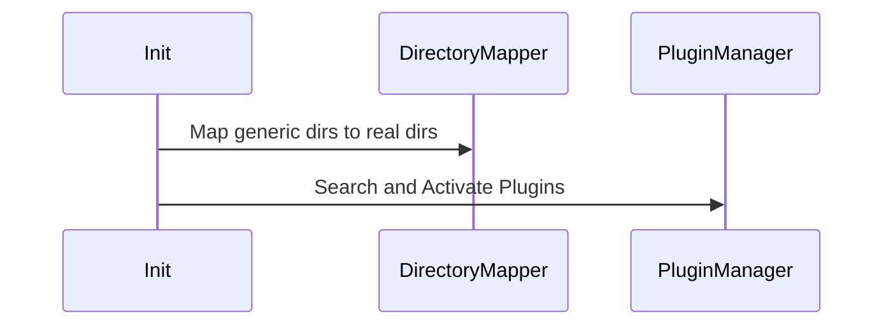
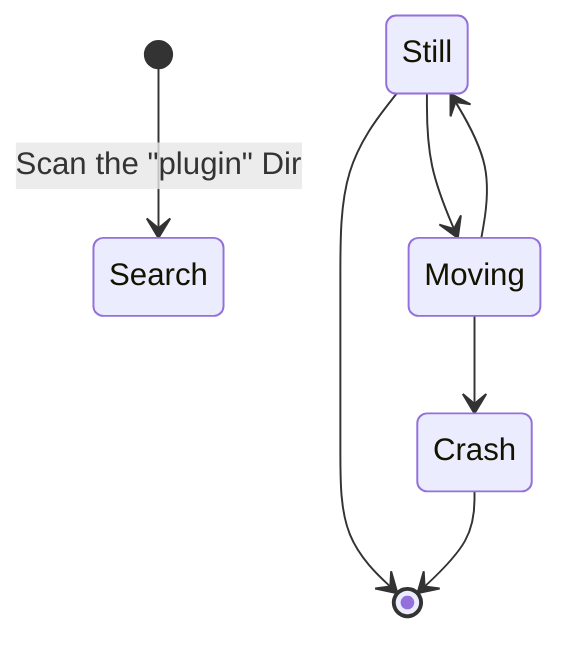

# WAS Developer Notes

## Boot Up

```mermaid
sequenceDiagram
    Init->>DirectoryMapper: Map generic dirs to real dirs
    Init->>PluginManager: Search and Activate Plugins

```

## Plugin Manager

```mermaid
stateDiagram-v2
    [*] --> Search : Scan the "plugin" Dir
    Still --> [*]
    Still --> Moving
    Moving --> Still
    Moving --> Crash
    Crash --> [*]

```