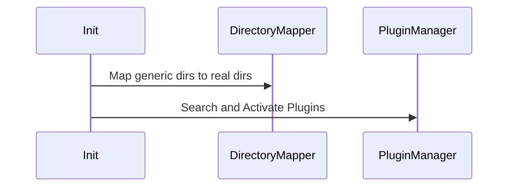
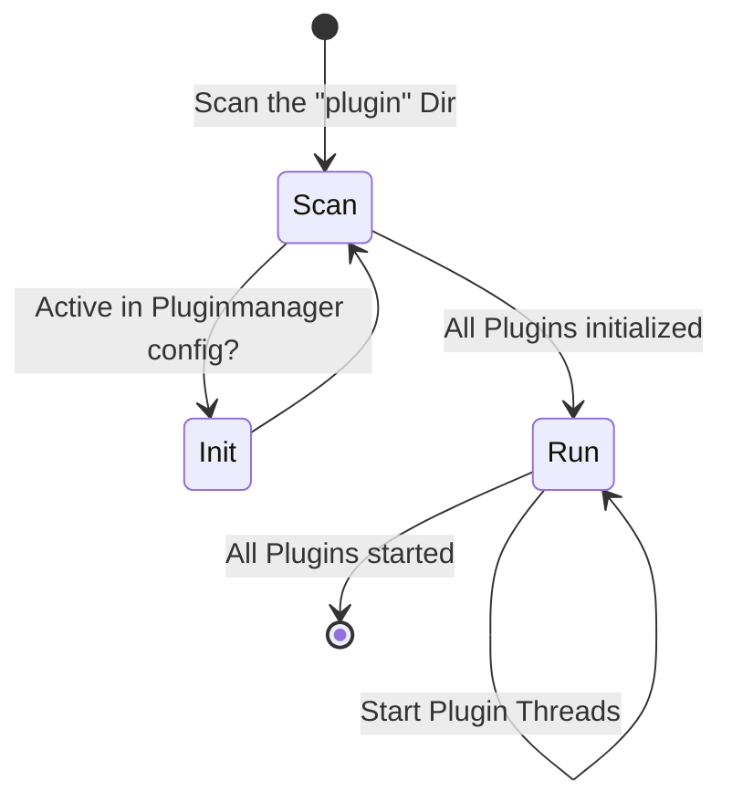

# WAS Developer Notes

WAS (Web Application Skeleton) is a framework to create an application made out of one or more threads, which can communicate to each other with a simple build-in message system.

The framework itself takes care about the startup and the message handling, while the application logic itself is realized by the specific plugins.

These plugins are all child classes of the splthread parent class.

All plugins are located inside the `plugins` folder as one file per thread. WAS searches als loads the plugins from there during startup.

These files are identified by their file names starting with `spl_`.


There are two "pre-delivered" plugins coming with WAS:
 * spl_webserver: This is a webserver which supports a websocket connection which joined to the message system, so that the client side browser application can seamlessly talk with the plugins
 * spl_eventdebugger: This is a debugging tool which allows to monitor and inject messages from a browser window into the app for testing and debugging purposes.

 ## Config or Data Storage (JsonStorage)

 As the applications may run in different environments like local or in a docker container, there might be different file systems around.

 To relief the plugin logics from any file structure depentencies when read or store data in the file system, there's a helper class `JsonStorage`.
 This class provides methods to read and store dictonary data, where the class takes care that the different plugins do not interfear each other and that the data is physically stored at the right places (in the `volumes`subtree folders)

 ## Message types and other global settings

 The definion of mainly all message types and some other global settings are made in the `defaults.py`file

## Boot Up


### Plugin Manager


### Plugin Initialisation (\__init__ construction)
When the constructor of a plugin is called, then inside the constructor the following tasks are executed:
* open the plugin specific config by generating its `JsonStorage`
* setup all necessary plugin specific stuff
* finally add its own event- and queryhandler to the global message queue

### Plugin Run
When all plugins are initialized (which are all python threads), the `PluginManager` calls the thread `run` method of each plugin, so that finally all threads running in their own run loop, waiting for events to come in to react on.

## Event -and Query Handling
As said, each plugin has its own event- and queryhander.
The difference between these both is basically just that the event handler returns just the event itself for further processing (or returns `NONE` to stop further process), while in opposite of that the query handler returns an (empty) array of found query results.

That also means that when somebody raises an event, that call returns immediadly and does not return any result, while raising a query that always returns an array of query result; so when raising a query, the originator is blocked until all other plugins have handled the query.

All events and queries have the same root structure:

```
{
    type: type of message as defined in defaults.py
    data: type depending data (string, numbers, lists, dicts, objects)
}

Internally the events can even contain other other objects, but when sending events to the web client, the whole event need be json-serializable

```

## Web Interface
The pre-delivered webserver serves static pages out of the `static` folder.

In the provided `index.html` sample inside the static folder there's a piece of javascript showing the principle of the websocket communication.
* at first the webpage sends a `_join` event with an optional id and password. In case that the application need to distingliush between different connected clients, the id should be unique in any way to control the message flow.

If in that communication the user id is set to `NONE`, the message is send to all connected clients.

The messages send through the websockets have the same structure as the normal events decribed above. When received by the `MessageHandler`, the whole message is wrapped into a event structure and send as event:

{
    type: MSG_SOCKET_MSG
    data: data as received from the web socket
}